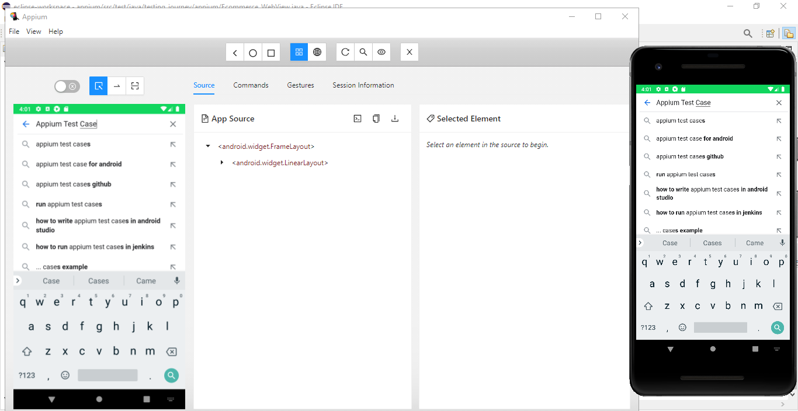

# App__Testing_Appium

This project contains automated test cases implemented with Appium.

It utilizes many events and gestures like drag and drop, long press, scrolling, swiping, using clipboard, screen rotation, entering text, AndroidKeys etc.

Many different use cases have been tested like filling forms, user input, text validation, checking cart for correct items and price totals etc.

A hybrid app with external websites through WebViews has also been tested for browser interaction, scrolling past cookies popup, searching etc.
A separate test case for the Chrome browser app has also been implemented.

## Screenshots

 
 

 

