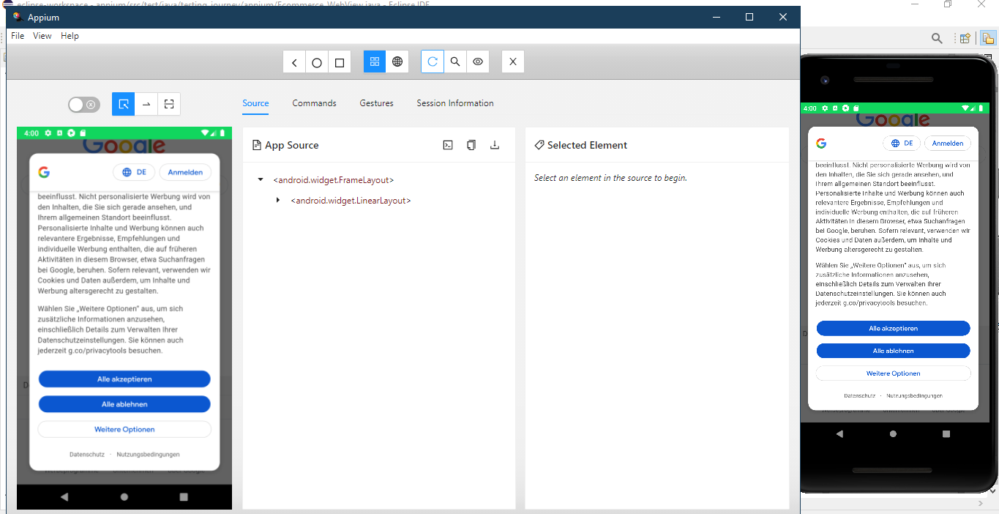

# App__Testing_Appium

This project contains different test use cases implemented with Appium and UIAutomator.

It includes testing gestures like drag and drop, long press, scrolling, swiping etc and entering text and events like screen rotation.

Many different use cases like filling forms, user input, text validation, checking cart for correct items, WebViews and Chrome browser have been tested.

## Screenshots

 
 
 

